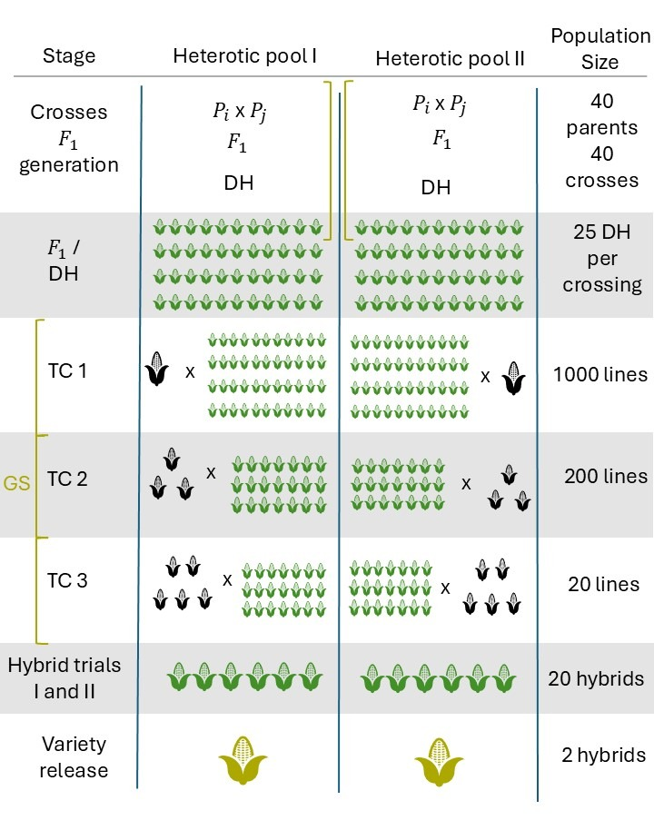

# Haplo-GS-Simulations
Haplotype-based Genomic Selection models in simulated maize populations.
# 🌽 Genomic Selection Simulation Pipeline in Maize

This repository contains an R-based simulation pipeline for evaluating the long-term effects of genomic selection (GS) strategies in maize breeding. The simulation models realistic breeding programs over 30 years using **AlphaSimR**, comparing SNP- and haplotype-based genomic selection under different trait architectures and population structures.

> Developed with support from [Dr. Marco A. Peixoto](https://github.com/marcopxt)

---

## 📈 Breeding Pipeline Workflow



*Figure: Schematic overview of the breeding pipeline implemented in the simulation.*

---

## 📘 Overview

This pipeline simulates:

- A realistic maize breeding program with testcross stages
- Burn-in and future breeding cycles (e.g., 15 years + 20 years)
- Multiple GS scenarios using SNPs, QTLs, and haplotypes
- Metrics like genetic gain, variance, inbreeding, and LD
- Genomic selection via the **GBLUP model** using the `BGLR` package

---

## 🧬 Scenarios Simulated

Each scenario varies the markers used to build the genomic relationship matrix:

- `SNP`: Standard SNP-based GS
- `Haplo`: Haplotype-based GS using sliding windows
- `SNP_QTL`: SNPs located at known QTL positions
- `Haplo_QTL`: Haplotype blocks constructed from known QTLs

All simulations track genetic trends across 35 years (15 burn-in + 20 selection cycles).

---

## 📂 Repository Structure

├── run_simulation.R # Main simulation script
├── GlobalParameters.R # Core simulation settings
├── CreateParents.R # Initial population generation
├── Advance*.R # Advance breeding pipeline
├── Update*.R # GS-specific selection and updates
├── WriteRecordsGS.R # Records phenotypes/genotypes
├── Results_*.rds # Saved results for each scenario
└── images/
└── breeding_pipeline.png

---

## 📦 Requirements

This pipeline runs in R with the following packages:

- [AlphaSimR](https://cran.r-project.org/package=AlphaSimR)
- [BGLR](https://cran.r-project.org/package=BGLR)
- [AGHmatrix](https://cran.r-project.org/package=AGHmatrix)

Install them with:

```r
install.packages(c("AlphaSimR", "BGLR", "AGHmatrix"))

📖 Citation
If you use this code or build upon this pipeline, please cite:

AlphaSimR:
Gaynor RC, Gorjanc G, Hickey JM. (2021). AlphaSimR: An R package for breeding program simulations. G3 Genes|Genomes|Genetics. https://doi.org/10.1093/g3journal/jkab055

🙌 Acknowledgments
Special thanks to Dr. Marco A. Peixoto for guidance in developing this pipeline and the Dr. Marcio Resende - Sweet Corn Genomics and Breeding Lab at the University of Florida for computational resources and support.
